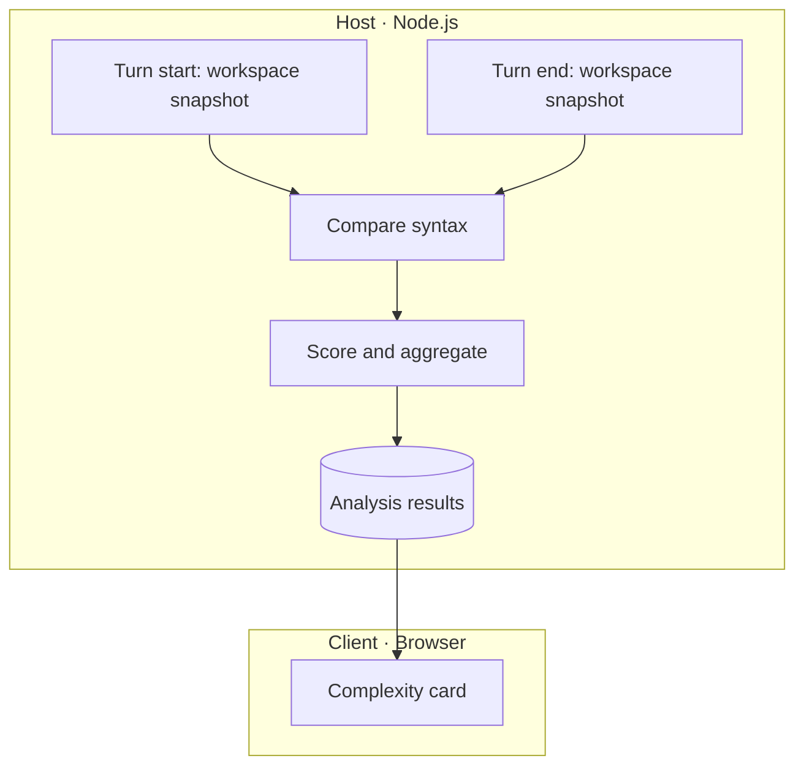

# Design

English | [中文](design.zh.md)

See the [README](../README.md) for installation, configuration, and supported languages

Detailed language rules and their sources are in [Scoring](scoring.md)

## Design goals

Noema is for developers who want control over AI-generated code. It shows complexity changes after each turn, helping developers decide which code needs closer attention and reducing the burden of reviewing large changes line by line

The results support human review. Developers judge whether the code meets their standards

## Analysis scope

Each turn compares the workspace before and after the task, including cancelled or failed tasks. Existing uncommitted code forms the baseline, and manual edits made during the task are included in the comparison

File extensions determine analysis support. Include and exclude settings and the project's ignore rules determine which files are analyzed

Syntax-tree comparison determines whether code changed. Comments, source positions, and formatting are ignored; changes to operators, literals, and syntax structure are retained. Code can change while its complexity scores remain the same

Renames, file moves, and functions without an unambiguous before-and-after match are treated as additions and removals. Entirely deleted files are omitted; deleted functions within surviving files remain visible. No card appears when there are no code changes to analyze

## Complexity metrics

### Cyclomatic complexity

Cyclomatic complexity measures the number of independent paths through code. A function starts at 1; branches and short-circuit conditions add points. Nesting depth adds no separate penalty

Scoring follows [NIST SP 500-235, §4](https://nvlpubs.nist.gov/nistpubs/Legacy/SP/nistspecialpublication500-235.pdf#page=43). Noema's convention for anonymous functions is described under metric aggregation below

### Cognitive complexity

Cognitive complexity measures the difficulty of understanding control flow. Branches, logical operations, and recursion add points. Some control structures also receive points for nesting

Scoring follows the [Cognitive Complexity white paper v1.7](https://www.sonarsource.com/docs/CognitiveComplexity.pdf), including its language exceptions. The white paper takes precedence over differences in analyzer implementations

### Maximum nesting depth

Maximum nesting depth is the greatest number of nested control structures within a function. A function without control structures has depth 0. Consecutive `else if` branches stay at the same level; logical operators and ordinary blocks add no depth

Depth is measured separately for each function. Entering a nested function starts at 0, including anonymous functions

## Result presentation

### Tree structure

Named functions appear beneath their file, with nested functions beneath the enclosing function. Names can come from function declarations, variables, or properties. Classes and namespaces have no separate rows

```text
file
├─ [Top Level]
└─ outer
   ├─ [Top Level]
   └─ inner
      ├─ [Top Level]
      └─ deeper
```

Expandable files and functions start collapsed. Unchanged code, including `[Top Level]`, is hidden. **Show unchanged functions** reveals it within the selected file or function and then disappears

### Top Level

`[Top Level]` shows the complexity of a file or function's own code, including anonymous functions. Named child-function bodies are measured separately

When expanded, `[Top Level]` always appears first and keeps its English name. Files and functions without named children show their metrics directly, with no expansion control

### Metric aggregation

Files and functions aggregate their own `[Top Level]` with their immediate named child functions. Nested functions follow the same rule at every level

| Metric | `[Top Level]` calculation | File or function aggregation |
| --- | --- | --- |
| Cyclomatic complexity | Count branches with a starting value of 1 for a named function; anonymous functions add no separate starting value | Sum |
| Cognitive complexity | Score using nesting in the source code and the language's rules | Sum |
| Maximum nesting depth | Take the maximum across the file or function's own code and its anonymous functions | Maximum |

A nested function's cognitive score includes points for its nesting in the source code and may differ from measuring it in isolation. Aggregation adds no further points

File and function metrics include all the code they contain, while expanded views initially show only changed code

## Architecture



Analysis results are stored separately for each session. Reading a session does not load other sessions' data

Noema uses Tree-sitter to parse code into syntax trees. The parser runs locally through WASM distributed with the plugin

Scoring rules are implemented separately for each language, applying the metric definitions to that language's syntax. TypeScript and TSX use the same scoring rules
