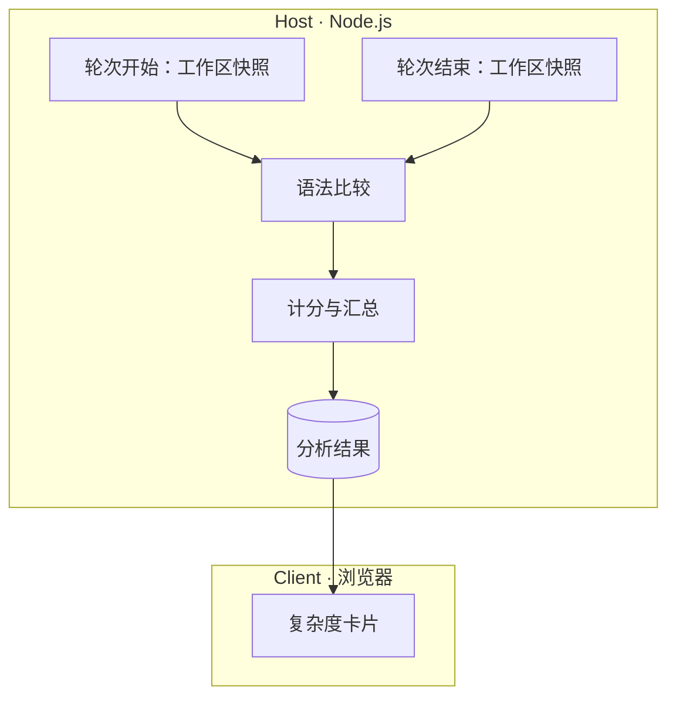

# 设计说明

[English](design.md) | 中文

安装、配置和支持的语言见 [README](../README.zh.md)

各语言的具体规则及依据见[计分规则](scoring.zh.md)

## 设计目标

Noema 面向希望掌控 AI 生成代码的开发者。它展示每轮修改带来的复杂度变化，帮助开发者确定需要重点阅读的代码，减轻逐行审查大量代码的负担

分析结果用于人工审查，由开发者判断代码是否符合自己的要求

## 分析范围

每轮对话比较任务开始前与结束后的工作区，包括取消或失败的任务。开始前已有的未提交代码作为比较基准，任务期间的人工修改也纳入比较

文件后缀决定是否支持分析，包含与排除设置以及项目的忽略规则决定哪些文件参与分析

代码是否变化由语法树比较确定。注释、位置移动和格式调整不算代码变化，运算符、字面量和语法结构的修改会保留。代码发生变化时，复杂度数值可能保持不变

重命名、文件移动以及无法确定修改前后对应关系的函数，按新增与删除处理。整个删除的文件不显示，仍然存在的文件中被删除的函数继续显示。没有可分析的代码变化时，不显示卡片

## 复杂度指标

### 圈复杂度

圈复杂度衡量代码中独立路径的数量。函数起始分为 1，分支和短路条件增加分数，嵌套层数不额外加分

计分依据为 [NIST SP 500-235 第 4 节](https://nvlpubs.nist.gov/nistpubs/Legacy/SP/nistspecialpublication500-235.pdf#page=43)，匿名函数在 Noema 中的计分约定见下文的指标汇总

### 认知复杂度

认知复杂度衡量理解控制流程的难度。控制分支、逻辑运算和递归增加分数，部分控制结构还按嵌套层数加分

计分依据为 [Cognitive Complexity 白皮书 v1.7](https://www.sonarsource.com/docs/CognitiveComplexity.pdf)，包含其中的语言例外。分析器实现与白皮书存在差异时，以白皮书为准

### 最大嵌套深度

最大嵌套深度是函数内控制结构的最大层数。没有控制结构时为 0，连续的 `else if` 分支保持同层，逻辑运算符和普通代码块不增加深度

每个函数单独计算深度，进入嵌套函数后从 0 开始，匿名函数也遵循这一规则

## 结果展示

### 树形结构

文件下列出具名函数，嵌套函数列在外层函数下。函数名可以来自函数声明、变量名或属性名，类和命名空间不单独显示

```text
file
├─ [Top Level]
└─ outer
   ├─ [Top Level]
   └─ inner
      ├─ [Top Level]
      └─ deeper
```

可展开的文件和函数默认折叠。未变化的代码默认隐藏，包括 `[Top Level]`。点击“显示未出现变化的函数”后，在当前文件或函数下显示这些代码，按钮随即消失

### Top Level

`[Top Level]` 显示文件或函数自身代码的复杂度，包含匿名函数，具名子函数的函数体单独计分

展开后，`[Top Level]` 固定排在第一行，名称保持英文。没有具名子函数时，指标直接显示在文件或函数上，无需展开

### 指标汇总

文件和函数的指标由自身的 `[Top Level]` 与直接包含的具名函数汇总，内部函数按相同规则逐层计算

| 指标 | `[Top Level]` 的计算 | 文件或函数的汇总 |
| --- | --- | --- |
| 圈复杂度 | 计算分支分数，具名函数起始分为 1，匿名函数不增加独立起始分 | 求和 |
| 认知复杂度 | 按源码中的嵌套层数和语言规则计分 | 求和 |
| 最大嵌套深度 | 自身代码与各匿名函数的深度取最大值 | 取最大值 |

嵌套函数的认知复杂度包含它在源码中的嵌套加分，可能与单独测量该函数的结果不同，汇总时不再额外加分

文件和函数的复杂度包含内部全部代码，展开后默认只显示有变化的部分

## 整体架构



分析结果按会话分别存储，读取一个会话时只加载该会话的数据

Noema 使用 Tree-sitter 将代码解析为语法树，通过随插件分发的 WASM 在本地运行解析器

计分规则按语言分别实现，根据各语言的语法应用指标定义。TypeScript 与 TSX 使用相同的计分规则
